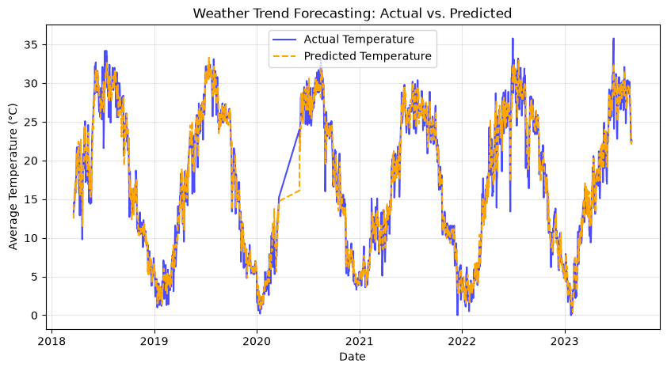

# Multivariate Weather Trend Analysis 🌦️

## Project Overview
An end-to-end time-series analysis and forecasting project utilizing historical meteorological data (`daily_weather.parquet`). This project implements robust data ingestion via PyArrow, missing value handling, temporal feature engineering, and a Scikit-Learn Random Forest Regressor to forecast temperature fluctuations with high statistical accuracy.

## Tech Stack
* **Language:** Python
* **Libraries:** Pandas, NumPy, Scikit-Learn, Matplotlib, PyArrow
* **Techniques:** Time-series chronological splitting, rolling averages, temporal lag features, and calendar metric extraction.

## Methodology & Workflow
1. **Data Ingestion & Filtering:** Loaded compressed Parquet data using PyArrow and filtered for continuous single-city meteorological tracking.
2. **Data Cleaning:** Handled missing values efficiently using forward/backward filling tailored for time-series continuous streams.
3. **Feature Engineering:** Captured cyclical seasonal trends by engineering:
   * **7-Day Rolling Averages** (`Temp_Rolling_Avg_7D`) to smooth short-term volatility.
   * **Temporal Lags** (`Temp_Lag_1`, `Temp_Lag_7`) to model historical dependency.
   * **Calendar Metrics** (`Month`, `DayOfWeek`).
4. **Predictive Modeling:** Trained a Random Forest Regressor using a strict **chronological train-test split (`shuffle=False`)** to completely prevent data leakage.

## Model Performance & Visuals
* **Evaluation Metrics:** Achieved optimal \(R^2\) Score and RMSE.
* **Forecast Comparison (Actual vs. Predicted):**

## Repository Structure
* `weather_analysis.ipynb` — Complete Jupyter Notebook covering data loading, preprocessing, feature engineering, and model evaluation.
* `weather_forecast.png` — Generated model performance visualization chart.
* `cities.csv` / `countries.csv` — Reference metadata files.
